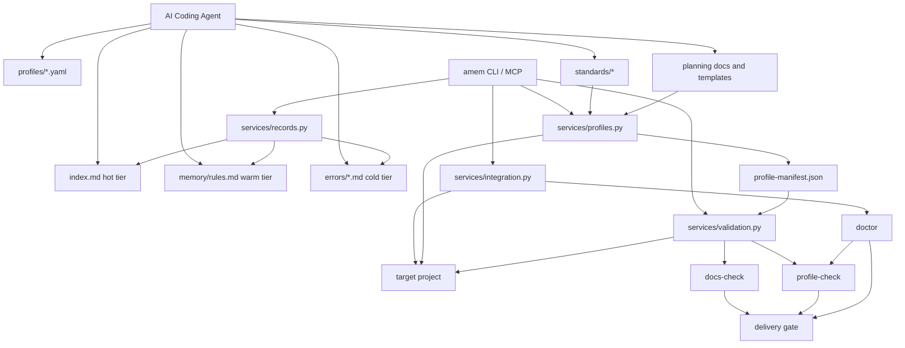

# Agents-Memory

Agents-Memory 正在从“共享错误记忆系统”升级成一个面向 AI coding agents 的 **Shared Engineering Brain**: 用统一的记忆、标准、规划和验证能力，把一次项目里的经验沉淀成跨项目可复用的工程操作系统。

## 它解决什么问题

多数 AI coding agent 的问题不是“不会写代码”，而是：

1. 同样的错误会在不同项目里反复出现。
2. 工程规范、任务规划和交付验证没有统一载体。
3. 文档、规则和代码行为很容易漂移。

Agents-Memory 的目标是把这些能力放进同一个共享层：

```text
Shared Engineering Brain
├── Memory      记录错误、复盘、规则升级
├── Standards   下发工程规范与默认约束
├── Planning    沉淀 requirement → plan → task graph 工作流
└── Validation  把 docs/profile/doctor 等检查做成门禁
```

## 当前状态

当前仓库已经可用的核心能力：

1. 结构化错误记录、关键词搜索、向量搜索、规则升级与跨项目同步。
2. MCP server、bridge instruction、GitHub Copilot adapter 接入链路。
3. `profiles/`、`standards/`、`plan-init`、`plan-check`、`profile-apply`、`profile-check`、`docs-check` 第一版能力。
4. 面向“AI Engineering Operating System”的目标架构和治理文档。

当前还在持续推进的方向：

1. `standards-sync` 的冲突检测、项目覆盖层和更细粒度同步策略。
2. 更成熟的 planning workflow 模板和 spec-first 约束。
3. 更强的 validation gate 和开源规范自动检查。

## 核心设计

### 1. 三层记忆架构

```text
index.md          热区：始终加载，控制在低 token 成本
memory/rules.md   温区：按领域按需加载
errors/*.md       冷区：通过搜索按需拉取原始案例
```

这不是“压缩 prompt”的技巧，而是把高频摘要、可执行规则和原始案例拆成三个层级，让 agent 默认只读最小必要上下文。

### 2. 显式自我进化闭环

```text
error
  → record
  → review
  → promote
  → sync
  → next session prevents the same mistake
```

Agents-Memory 不依赖模型“自己记住”，而是把错误经验显式升级成规则、模板和 instructions。

### 3. Shared Engineering Brain 路线

架构文档已经明确了最终目标：[docs/ai-engineering-operating-system.md](docs/ai-engineering-operating-system.md)。当前仓库不是要停留在 error memory，而是继续把 `standards/`、`profiles/`、planning 模板和 validation gate 变成一等公民。

### 4. 系统架构图



## 快速开始

### 安装方式

如果你只想直接使用仓库内脚本：

```bash
git clone https://github.com/haochencheng/Agents-Memory.git
cd Agents-Memory
python3 scripts/memory.py list
```

如果你想把 `amem` 安装成命令：

```bash
git clone https://github.com/haochencheng/Agents-Memory.git
cd Agents-Memory
python3 -m pip install -e .
amem list
```

如果你希望安装系统级软链接，也可以使用：

```bash
bash scripts/install-cli.sh
```

### 常用命令

```bash
# 错误记录与搜索
python3 scripts/memory.py new
python3 scripts/memory.py list
python3 scripts/memory.py stats
python3 scripts/memory.py search "pydantic"

# 规则升级与同步
python3 scripts/memory.py promote 2026-03-26-spec2flow-001
python3 scripts/memory.py sync

# 项目接入
python3 scripts/memory.py register .
python3 scripts/memory.py doctor .
python3 scripts/memory.py copilot-setup .
python3 scripts/memory.py bridge-install your-project
python3 scripts/memory.py mcp-setup .

# Planning / Shared Engineering Brain 第一版能力
python3 scripts/memory.py plan-init "shared engineering brain task" .
python3 scripts/memory.py plan-check .
python3 scripts/memory.py profile-list
python3 scripts/memory.py profile-show python-service
python3 scripts/memory.py profile-diff python-service .
python3 scripts/memory.py profile-apply python-service .
python3 scripts/memory.py standards-sync .
python3 scripts/memory.py profile-check .
python3 scripts/memory.py docs-check .
```

### 验证仓库

```bash
python3.12 -m unittest discover -s tests -p 'test_*.py'
python3.12 -m py_compile $(find agents_memory scripts -name '*.py' -print)
python3 scripts/memory.py docs-check .
```

## 功能地图

### Memory

1. `new`, `list`, `stats`, `search`, `embed`, `vsearch`
2. `promote`, `sync`, `archive`, `update-index`
3. `memory_get_index`, `memory_get_rules`, `memory_search`, `memory_record_error`

### Integration

1. `register`, `doctor`, `bridge-install`, `mcp-setup`
2. `agent-list`, `agent-setup`, `copilot-setup`
3. `templates/agents-memory-bridge.instructions.md`
4. `templates/agents-memory-copilot-instructions.md`

### Standards / Planning / Validation

1. `standards/python/*`
2. `standards/docs/*`
3. `standards/planning/*`
4. `standards/validation/*`
5. `profiles/*.yaml`
6. `plan-init`, `plan-check`, `profile-apply`, `standards-sync`, `profile-check`, `docs-check`

`profile-apply` 现在会默认写出 `docs/plans/README.md` 入口模板，`doctor` 也会开始感知 planning root 和 planning bundle 健康状态。
`doctor` 的输出现在按 `Core / Planning / Integration / Optional` 分组，并为每个分组生成健康小结与修复建议，更接近 Shared Engineering Brain 的工程操作系统控制台。

## 开源与本地运行数据边界

公开仓库应只包含代码、模板、标准、profiles 和文档。以下内容属于本地运行数据，默认不应提交：

```text
index.md
memory/projects.md
memory/rules.md
errors/*.md
.vscode/mcp.json
logs/
vectors/
```

首次运行时，仓库会使用 `templates/` 中的公开安全样例来初始化本地文件：

```text
templates/index.example.md
templates/projects.example.md
templates/rules.example.md
templates/mcp.example.json
```

这也是本项目能够开源而不暴露真实项目上下文的关键边界。

## 仓库结构

```text
Agents-Memory/
├── agents_memory/    CLI、MCP、services、agent adapters
├── standards/        组织级工程标准与校验规则
├── profiles/         可安装的项目工程契约
├── templates/        bridge / copilot / profile bootstrap 模板
├── docs/             架构、接入、运维、路线图文档
├── tests/            services 与 validation 的最小测试矩阵
├── llms.txt          给 agent 的机器可读项目地图
└── README.md         对外入口
```

更完整的文档入口见 [docs/README.md](docs/README.md)。

## 文档导航

1. [docs/getting-started.md](docs/getting-started.md): 安装、启动、日常命令
2. [docs/integration.md](docs/integration.md): 把 Agents-Memory 接到其他项目
3. [docs/ops.md](docs/ops.md): 向量搜索、Qdrant、日志和运维
4. [docs/modular-architecture.md](docs/modular-architecture.md): 模块与插件架构
5. [docs/ai-engineering-operating-system.md](docs/ai-engineering-operating-system.md): Shared Engineering Brain 目标模型
6. [docs/foundation-hardening.md](docs/foundation-hardening.md): 打地基与治理策略
7. [docs/architecture.md](docs/architecture.md): ADR 与架构决策

## 为什么现在更适合开源

和之前相比，这个仓库现在更接近一个可开源的工程项目，而不只是作者本地工具箱，因为它已经具备：

1. 本地运行数据与公开模板的明确边界。
2. `README`、`docs/README.md`、`llms.txt` 三层入口。
3. `LICENSE`、`CONTRIBUTING.md` 和基础验证命令。
4. 避免把 author-specific 路径写进公开模板的安装策略。

如果继续往成熟开源项目推进，下一步最值得补齐的是 CI、issue templates 和 release 节奏。

## 贡献方式

欢迎把它当作一个正在演进的工程操作系统来贡献，而不只是提小 patch。

在提交任何行为变更前，请同步更新：

1. 代码
2. 对应文档
3. 对应测试或验证脚本

贡献说明见 [CONTRIBUTING.md](CONTRIBUTING.md)。

## 许可证

本项目采用 [MIT License](LICENSE)。

---

## Search Backend Roadmap

当错误记录超过 200 条后，可以引入本地向量搜索：

```python
# 届时只需加这一层
import lancedb
db = lancedb.connect("./vectors")
table = db.open_table("errors")
results = table.search(query_embedding).limit(5).to_pandas()
```

错误记录的 schema 已经设计好，迁移时只需：
1. `pip install lancedb openai`
2. 跑一次 embedding 脚本把 `errors/*.md` 向量化写入 LanceDB
3. 替换 `cmd_search()` 的实现

现有的所有错误记录文件**不需要改**。
