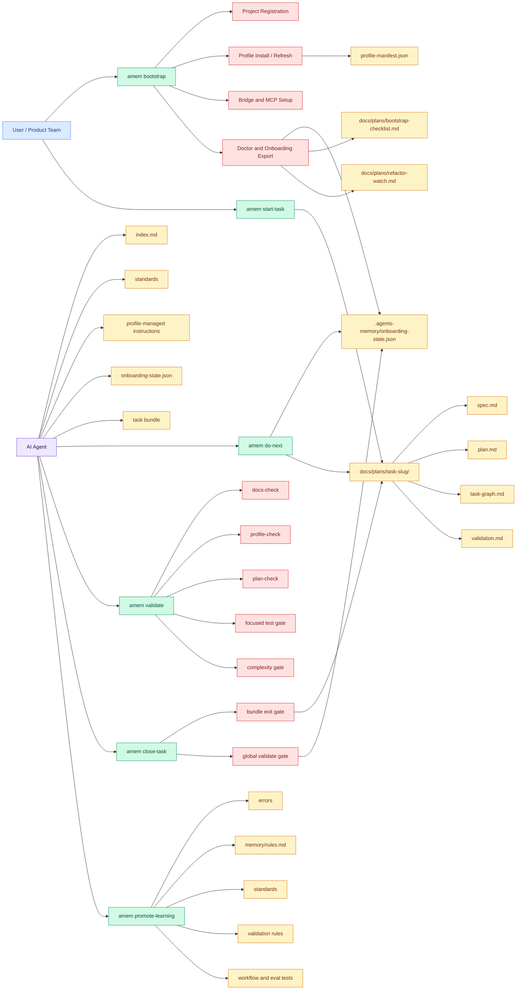
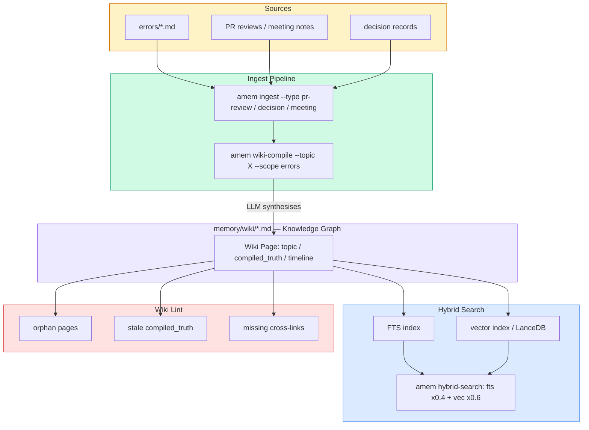
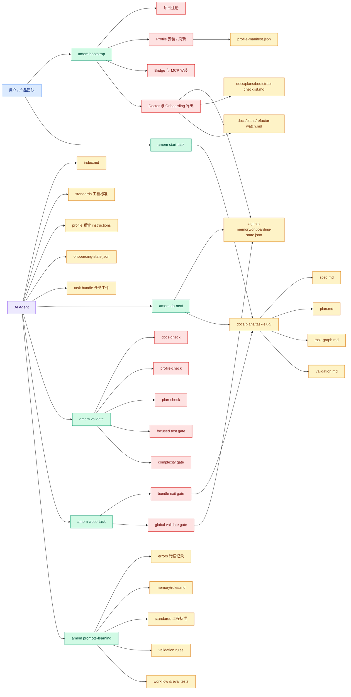
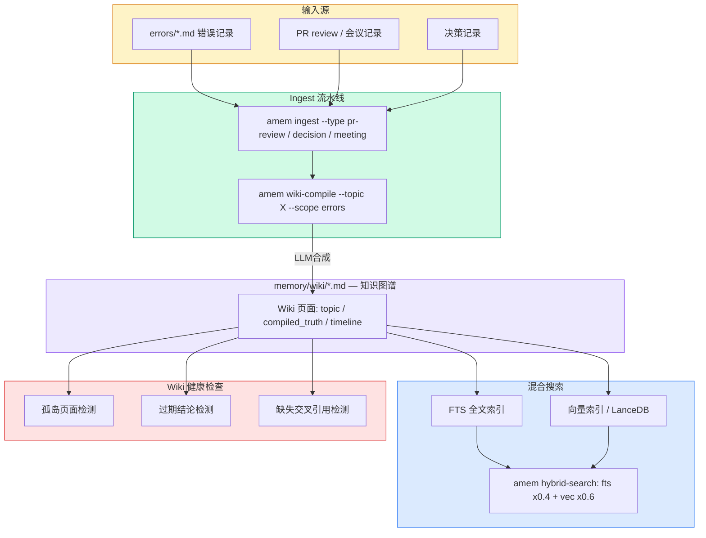

# Agents-Memory

<a id="top"></a>

[](LICENSE)


[](https://github.com/haochencheng/Agents-Memory/releases)
[](https://github.com/haochencheng/Agents-Memory/actions/workflows/ci.yml)
[](CHANGELOG.md)
[](docs/release-checklist.md)
[](https://github.com/haochencheng/Agents-Memory/graphs/contributors)
[](https://github.com/haochencheng/Agents-Memory/commits/main)
[](https://github.com/haochencheng/Agents-Memory)

Read in: [English](#en) | [简体中文](#zh)

---

<a id="en"></a>

## English

Agents-Memory is a **Shared Engineering Brain** for AI coding agents. It gives teams a reusable runtime for engineering memory, standards, planning bundles, and validation gates across real repositories.

### Why Teams Install Agents-Memory

| Operational Memory | Workflow Discipline | Safer Delivery |
| --- | --- | --- |
| Capture repeated failures, promote rules, and carry engineering context across repos. | Turn freeform requests into bootstrap, planning bundles, and validation-first execution. | Gate changes with docs-check, profile-check, plan-check, CI, and release discipline. |

### System Architecture



**Five layers inside the Brain:**

| Layer | Responsibility |
| --- | --- |
| **Memory** | Tiered hot / warm / cold error records; keyword + vector hybrid search |
| **Standards** | Shared Python, docs, planning, validation standards; profile-managed instructions |
| **Planning** | spec → plan → task graph → validation bundle; `start-task` / `do-next` / `close-task` |
| **Validation** | Unified delivery gate: docs-check, profile-check, plan-check, test gate, complexity gate |
| **Learning Bus** | Promote errors and good practices to standards, validation rules, and eval cases |

### Knowledge Layer (Wiki) Architecture

The Memory layer includes a structured wiki knowledge graph. This is a **zoom-in on the Memory layer**, not a separate system.



**Wiki page anatomy** (compiled_truth + append-only timeline):

```markdown
---
topic: finance-safety
compiled_at: 2026-04-07
confidence: high
sources: [AME-001, AME-007]
links:
  - topic: smart-contract-errors
    context: "Reentrancy overlaps with precision rules"
---

## Compiled Truth        ← LLM rewrites on each wiki-compile run
> Consolidated finding: use Decimal, never float for on-chain values.

## Known Patterns
- AME-001: USDT precision loss on transfer

---

## Timeline             ← append-only, never rewritten
- **2026-04-07** | wiki-compile — synthesised from 7 error records
- **2026-03-20** | AME-007 — first recorded precision failure
```

**Wiki commands:**

| Command | Purpose |
| --- | --- |
| `amem wiki-compile --topic X` | LLM synthesises compiled_truth from latest errors |
| `amem wiki-link <from> <to>` | Add cross-reference between topics |
| `amem wiki-backlinks <topic>` | Show all pages linking to this topic |
| `amem wiki-lint` | Detect orphans, stale truths, missing links |
| `amem ingest <file> --type ...` | Structured ingest of PR / meeting / decision records |

**Code layout:**

```text
agents_memory/
├── app.py            # CLI entry point
├── mcp_app.py        # MCP Server entry point
├── runtime.py        # AppContext, path resolution
├── commands/         # CLI dispatch → services
├── services/         # Business logic (records, search, wiki, planning, …)
├── integrations/     # Agent adapters (GitHub Copilot, ChatGPT, Claude)
└── web/              # FastAPI REST API + Streamlit UI (ports 10100 / 10000)
```

### Workflow

```text
connect project
  -> amem bootstrap .          # register + profile + MCP + doctor
  -> amem start-task "<task>"  # spec + plan + task graph + validation bundle
  -> implement with shared standards
  -> amem validate .           # docs + profile + plan + tests + complexity
  -> amem close-task .         # gate + bundle close + onboarding state update
  -> amem promote-learning .   # promote errors / good practices to global defaults
```

### Quick Start

```bash
git clone https://github.com/haochencheng/Agents-Memory.git
cd Agents-Memory
python3 -m pip install -e .

# Verify installation
amem bootstrap . --dry-run
amem validate .

# Run tests
python3.12 -m unittest discover -s tests -p 'test_*.py'

# Start web UI (optional)
bash scripts/web-start.sh start   # FastAPI :10100, Streamlit :10000
```

### Trust Signals

1. [CI](https://github.com/haochencheng/Agents-Memory/actions/workflows/ci.yml) is public and mirrors the local install, compile, test, and docs-check path.
2. CI is split into `tests` and `docs` jobs for clearer branch protection.
3. [CHANGELOG.md](CHANGELOG.md) and [docs/release-checklist.md](docs/release-checklist.md) govern public release execution.
4. [SECURITY.md](SECURITY.md), [SUPPORT.md](SUPPORT.md), and [CONTRIBUTING.md](CONTRIBUTING.md) define collaboration paths up front.

### Documentation

| Doc | Purpose |
| --- | --- |
| [docs/getting-started.md](docs/getting-started.md) | Local install, startup, and baseline verification |
| [docs/integration.md](docs/integration.md) | How another repo integrates Agents-Memory |
| [docs/commands.md](docs/commands.md) | CLI command map and parameter reference |
| [docs/ops.md](docs/ops.md) | Operations, recovery, and troubleshooting |
| [docs/architecture.md](docs/architecture.md) | Repo-level ADRs and technical decisions |
| [docs/modular-architecture.md](docs/modular-architecture.md) | Code layering, agent adapters, extension points |
| [docs/ai-engineering-operating-system.md](docs/ai-engineering-operating-system.md) | Full product baseline and implementation status |

Full documentation map: [docs/README.md](docs/README.md)

### Open-Source Boundary

Public repository content is limited to code, templates, standards, profiles, and docs. The following are local runtime artifacts and should **not** be committed:

```text
index.md
memory/projects.md
memory/rules.md
errors/*.md
.vscode/mcp.json
logs/
vectors/
```

The repository uses public examples under `templates/` so real project context, private paths, and runtime data do not leak into the open-source tree.

### Contributing

Before shipping behavior changes, update code, matching docs, and matching tests or validation scripts together.

Contribution guidance lives in [CONTRIBUTING.md](CONTRIBUTING.md). Pull requests should follow [PULL_REQUEST_TEMPLATE.md](PULL_REQUEST_TEMPLATE.md). Community expectations live in [CODE_OF_CONDUCT.md](CODE_OF_CONDUCT.md). Security issues should follow [SECURITY.md](SECURITY.md). Support paths are listed in [SUPPORT.md](SUPPORT.md). Releases should update [CHANGELOG.md](CHANGELOG.md) and [docs/release-checklist.md](docs/release-checklist.md).

[Back to top](#top)

---

<a id="zh"></a>

## 简体中文

Agents-Memory 是面向 AI coding agents 的 **Shared Engineering Brain**。它把工程记忆、工程标准、planning bundle 和 validation gate 收敛成可复用的共享运行层，服务真实仓库而不是零散 prompt 片段。

### 为什么团队会安装 Agents-Memory

| 团队记忆沉淀 | 工作流约束 | 更稳的交付 |
| --- | --- | --- |
| 记录重复错误、升级规则，把工程上下文跨仓库复用。 | 把自由需求收敛成 bootstrap、planning bundle 和 validation-first 执行路径。 | 用 docs-check、profile-check、plan-check、CI 和 release discipline 约束交付。 |

### 系统架构全图



**五层核心能力：**

| 层级 | 职责 |
| --- | --- |
| **Memory** | 三层分级记忆（热 / 温 / 冷）；关键词 + 向量混合搜索 |
| **Standards** | 共享 Python、docs、planning、validation 标准；profile 受管 instructions |
| **Planning** | spec → plan → task graph → validation bundle；start-task / do-next / close-task |
| **Validation** | 统一交付门禁：docs-check、profile-check、plan-check、test gate、complexity gate |
| **Learning Bus** | 把错误和最佳实践升级为跨项目 standards、validation rules、eval cases |

### 知识层（Wiki）架构

Memory 层内置结构化 Wiki 知识图谱，是对上方系统架构图中 Memory 层的纵向展开，**不是独立系统**。



**Wiki 页面结构**（compiled_truth 结论区 + append-only 时间线）：

```markdown
---
topic: finance-safety
compiled_at: 2026-04-07
confidence: high
sources: [AME-001, AME-007]
links:
  - topic: smart-contract-errors
    context: "Reentrancy 与精度规则有重叠"
---

## 结论（Compiled Truth）        ← LLM 每次 wiki-compile 时整体重写
> 综合评估：链上金额运算必须用 Decimal，禁止使用 float。

## 已知 Pattern
- AME-001：USDT transfer 精度丢失

---

## 时间线                        ← 只追加，永不改写
- **2026-04-07** | wiki-compile — 从 7 条错误记录合成
- **2026-03-20** | AME-007 — 首次记录精度问题
```

**Wiki 命令：**

| 命令 | 作用 |
| --- | --- |
| `amem wiki-compile --topic X` | LLM 从最近错误合成 compiled_truth |
| `amem wiki-link <from> <to>` | 建立 topic 之间的交叉引用 |
| `amem wiki-backlinks <topic>` | 查看哪些页面引用了当前 topic |
| `amem wiki-lint` | 检测孤岛页、过期结论、缺失链接 |
| `amem ingest <file> --type ...` | 结构化导入 PR / 会议记录 / 决策文档 |

**代码分层：**

```text
agents_memory/
├── app.py            # CLI 总入口
├── mcp_app.py        # MCP Server 总入口
├── runtime.py        # AppContext，路径解析
├── commands/         # CLI 分发 → services
├── services/         # 业务逻辑（records、search、wiki、planning 等）
├── integrations/     # Agent adapters（GitHub Copilot、ChatGPT、Claude）
└── web/              # FastAPI REST API + Streamlit UI（端口 10100 / 10000）
```

### 工作流

```text
连接项目
  -> amem bootstrap .          # 注册 + profile + MCP + doctor
  -> amem start-task "<task>"  # spec + plan + task graph + validation bundle
  -> 按共享标准实现
  -> amem validate .           # docs + profile + plan + tests + complexity
  -> amem close-task .         # gate + bundle 关闭 + onboarding state 更新
  -> amem promote-learning .   # 把错误 / 最佳实践升级到全局默认
```

### 快速开始

```bash
git clone https://github.com/haochencheng/Agents-Memory.git
cd Agents-Memory
python3 -m pip install -e .

# 验证安装
amem bootstrap . --dry-run
amem validate .

# 运行测试
python3.12 -m unittest discover -s tests -p 'test_*.py'

# 启动 Web UI（可选）
bash scripts/web-start.sh start   # FastAPI :10100，Streamlit :10000
```

### 可信信号

1. [CI](https://github.com/haochencheng/Agents-Memory/actions/workflows/ci.yml) 是公开的，执行的就是本地会跑的安装、编译、测试和 `docs-check`。
2. CI 已拆成独立的 `tests` 和 `docs` jobs，便于 branch protection 单独要求通过。
3. [CHANGELOG.md](CHANGELOG.md) 和 [docs/release-checklist.md](docs/release-checklist.md) 共同约束公开发版流程。
4. [SECURITY.md](SECURITY.md)、[SUPPORT.md](SUPPORT.md) 和 [CONTRIBUTING.md](CONTRIBUTING.md) 让协作路径在首页即可追溯。

### 文档入口

| 文档 | 说明 |
| --- | --- |
| [docs/getting-started.md](docs/getting-started.md) | 首次安装、启动、基础验证 |
| [docs/integration.md](docs/integration.md) | 目标项目如何接入 Agents-Memory |
| [docs/commands.md](docs/commands.md) | CLI 命令总表与参数参考 |
| [docs/ops.md](docs/ops.md) | 日常运维、恢复与排障 |
| [docs/architecture.md](docs/architecture.md) | 仓库级 ADR 与技术决策 |
| [docs/modular-architecture.md](docs/modular-architecture.md) | 代码分层、agent adapter 扩展点 |
| [docs/ai-engineering-operating-system.md](docs/ai-engineering-operating-system.md) | 完整产品基线与实施状态矩阵 |

完整文档地图见 [docs/README.md](docs/README.md)。

最新架构设计见 docs/ai-engineering-operating-system.md。
安装与启动细节见 docs/getting-started.md。
接入其他项目见 docs/integration.md。

公开仓库只包含代码、模板、标准、profiles 和文档。以下内容属于本地运行数据，**默认不应提交**：

```text
index.md
memory/projects.md
memory/rules.md
errors/*.md
.vscode/mcp.json
logs/
vectors/
```

仓库使用 `templates/` 下的公开样例初始化本地文件，以避免把真实项目上下文、私有路径或运行时数据带进开源仓库。

### 贡献

提交行为变更前，请同步更新代码、对应文档以及对应测试或验证脚本。

贡献说明见 [CONTRIBUTING.md](CONTRIBUTING.md)。提交合并请求时请按 [PULL_REQUEST_TEMPLATE.md](PULL_REQUEST_TEMPLATE.md) 补齐验证信息；协作行为遵循 [CODE_OF_CONDUCT.md](CODE_OF_CONDUCT.md)；安全问题请按 [SECURITY.md](SECURITY.md) 私下报告；支持入口见 [SUPPORT.md](SUPPORT.md)；发布时同步维护 [CHANGELOG.md](CHANGELOG.md) 和 [docs/release-checklist.md](docs/release-checklist.md)。

[返回顶部](#top)

---

## License / 许可证

This project is released under the [MIT License](LICENSE).

本项目采用 [MIT License](LICENSE)。
