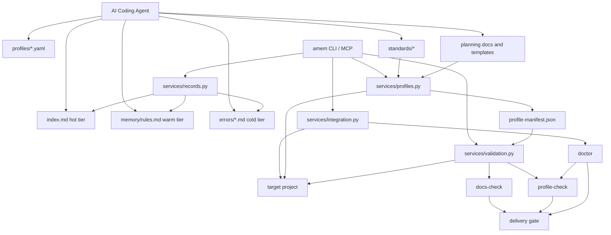

# AI Engineering Operating System

> 系统最终目标：把 Agents-Memory 从“共享错误记忆系统”升级成一个真正的 **Shared Engineering Brain**，即面向 AI coding agents 的工程操作系统。

---

## 1. 产品定位

### 最终目标

Agents-Memory 的最终目标，不只是共享错误，也不只是共享 instruction。

最终形态应当是：

```text
Shared Engineering Brain
```

也就是一个面向 AI 编码系统的统一工程大脑，包含四个核心子系统：

1. `Memory`
  错误、复盘、规则、自我进化

2. `Standards`
  Python 规范、TDD、DRY、工程化、文档规则

3. `Planning`
  Harness Engineering、Spec Kit、task graph、execution plan

4. `Validation`
  docs-check、contract-check、test-check、doctor、policy-check

这四层合在一起，才构成真正的 **AI Engineering Operating System**。

Agents-Memory 当前已经证明了一件事：

1. 错误可以被结构化记录
2. 错误可以被提炼成规则
3. 规则可以被同步到项目 instructions
4. Agent 可以在下一次编码中减少重复犯错

这说明“共享错误 + 自我进化”这条链路是成立的。

但如果产品目标是 **AI Engineering Operating System**，那么只共享错误还不够。

下一阶段要把下面几类能力也纳入统一共享层：

1. 统一开发规范
2. 统一 TDD / DRY / 工程化约束
3. 统一文档校验
4. 统一 plan / spec / task workflow
5. 统一 repo bootstrap

---

## 2. 当前能力边界

### 已有

1. 共享错误
2. 共享错误提炼规则
3. 跨项目接入：bridge / MCP / agent adapter
4. 项目注册、doctor、rule sync
5. MCP tools：`memory_get_index` / `memory_get_rules` / `memory_search` / `memory_record_error`

### 缺失

1. 统一工程规范层
2. 统一 profile 安装层
3. 统一 docs-check / standards-check
4. 统一 Harness Engineering workflow 模板
5. 统一 Spec Kit 风格 spec-first 约束

当前系统更像：

```text
Shared Error Memory Platform
```

目标系统应升级为：

```text
AI Engineering Operating System
```

---

## 3. 目标能力模型

目标产品不是一个单独的 memory 仓库，而是一个 **Shared Engineering Brain**，由四层能力组合而成。

```text
Shared Engineering Brain
├── Memory
├── Standards
├── Planning
└── Validation
```

### Layer 1. Memory

负责：

1. 共享错误
2. 共享错误搜索
3. 共享错误提炼规则
4. 自我进化闭环

现有落点：

1. `errors/*.md`
2. `memory/rules.md`
3. `index.md`
4. `promote / sync / doctor / record_error`

### Layer 2. Standards

负责：

1. 统一 Python 开发规范
2. 统一 TDD / DRY / 工程化约束
3. 统一文档规范
4. 统一 review checklist

这层不依赖错误发生，而是组织级默认契约。

### Layer 3. Planning

负责：

1. Harness Engineering workflow
2. Requirement → Plan → Task Graph
3. Spec Kit 风格 spec-first 约束
4. 执行计划模板、评审材料模板、验收标准模板

### Layer 4. Validation

负责：

1. docs-check
2. profile-check
3. standards-check
4. project doctor
5. bootstrap completeness check

这层负责把规则真正落地，否则 standards 只是文档陈列。

### 3.1 系统架构图



### 为什么必须是四层，而不是单一 memory

如果只有 `Memory`，系统只能做到：

1. 记录过去犯过什么错
2. 尽量避免重复犯错

但它做不到：

1. 在错误发生前统一约束开发方式
2. 在任务开始前统一规划与拆解
3. 在交付前自动校验文档、契约、测试与策略合规性

所以最终产品的定义必须是：

```text
Memory     管过去
Standards  管日常开发
Planning   管任务落地
Validation 管交付质量
```

只有这四层同时存在，Agents-Memory 才能从“错误记忆库”进化成“工程大脑”。

---

## 4. 产品核心闭环

未来完整闭环应该是：

```text
组织定义工程规范
  ↓
profile 安装到具体项目
  ↓
agent 开始工作前加载：index + standards + profile + workflow
  ↓
按 spec / task graph / docs-check 执行
  ↓
出现错误时记录到 errors
  ↓
重复错误提炼为 rules / gotchas
  ↓
同步回标准层或项目层
  ↓
下次自动规避
```

这里的关键升级是：

1. 错误不再是唯一数据源
2. 标准、计划、校验也成为共享系统的一等公民

---

## 5. 新的目录设计

建议把仓库扩成下面的结构。

```text
Agents-Memory/
├── agents_memory/
├── templates/
├── standards/
│   ├── python/
│   │   ├── base.instructions.md
│   │   ├── tdd.instructions.md
│   │   ├── dry.instructions.md
│   │   └── project-structure.instructions.md
│   ├── docs/
│   │   ├── docs-sync.instructions.md
│   │   ├── docs-check.rules.md
│   │   └── glossary.rules.md
│   ├── planning/
│   │   ├── harness-engineering.md
│   │   ├── spec-kit.md
│   │   ├── requirement-to-task-graph.md
│   │   └── review-checklist.md
│   └── validation/
│       ├── docs-check.rules.md
│       ├── standards-check.rules.md
│       └── profile-check.rules.md
├── profiles/
│   ├── python-service.yaml
│   ├── frontend-app.yaml
│   ├── fullstack-product.yaml
│   └── agent-runtime.yaml
├── docs/
└── scripts/
```

### 目录职责

#### `standards/`

组织级工程标准库。

内容必须是：

1. 跨项目复用
2. 不依赖单个项目私有上下文
3. 适合被自动同步或自动校验

#### `profiles/`

项目装配配置层。

每个 profile 描述：

1. 适用项目类型
2. 需要安装哪些 standards
3. 需要安装哪些 instructions
4. 需要生成哪些模板
5. 需要启用哪些校验命令

---

## 6. `standards/` 目录设计

### 6.1 Python 标准

建议拆成下面几类，而不是塞进一个大文件：

1. `base.instructions.md`
   Python 版本基线、typing、异常处理、依赖管理、目录结构

2. `tdd.instructions.md`
   测试先行、最小失败用例、回归测试要求、变更必须绑定验证

3. `dry.instructions.md`
   禁止复制粘贴实现、抽象边界、复用判断标准

4. `project-structure.instructions.md`
   服务层、仓储层、schema 层、CLI 层、入口层约束

### 6.2 Docs 标准

1. `docs-sync.instructions.md`
   行为变更必须同步 docs / examples / readme / instruction

2. `docs-check.rules.md`
   必填章节、链接完整性、术语一致性、命令有效性

3. `glossary.rules.md`
   统一术语表，减少项目间命名漂移

### 6.3 Planning 标准

1. `harness-engineering.md`
   接受 Harness Engineering 作为统一工作流基线

2. `spec-kit.md`
   接受 Spec Kit 风格的 spec-first 约束

3. `requirement-to-task-graph.md`
   需求如何转成任务图、依赖、验收点

4. `review-checklist.md`
   评审最小材料包：spec、plan、task graph、docs diff、validation

---

## 7. `profiles/` 目录设计

profile 的作用不是写规范，而是“装配规范”。

### 7.1 示例：`python-service.yaml`

建议至少包含这些字段：

```yaml
id: python-service
display_name: Python Service
applies_to:
  - backend
  - fastapi
standards:
  - standards/python/base.instructions.md
  - standards/python/tdd.instructions.md
  - standards/python/dry.instructions.md
  - standards/docs/docs-sync.instructions.md
  - standards/planning/harness-engineering.md
templates:
  - templates/profile/python-service/AGENTS.example.md
  - templates/profile/python-service/docs-check.example.yml
commands:
  docs_check: amem docs-check
  doctor: amem doctor
  standards_sync: amem standards-sync
bootstrap:
  create:
    - .github/instructions/
    - docs/
    - tests/
```

### 7.2 初始 profile 集合

建议先做 4 个：

1. `python-service`
2. `frontend-app`
3. `fullstack-product`
4. `agent-runtime`

这是第一批最容易落地、覆盖面也最大的 profile。

---

## 8. `amem profile-apply` 命令设计

### 目标

把 profile 从“文档说明”变成“真正可安装的工程契约”。

### 建议命令形态

```bash
amem profile-list
amem profile-show python-service
amem profile-apply python-service /path/to/project
amem profile-diff python-service /path/to/project
```

### `profile-apply` 需要做的事

1. 读取 `profiles/<id>.yaml`
2. 在目标项目创建缺失目录
3. 安装 / 更新 instructions
4. 写入模板文件
5. 写入 docs-check 配置
6. 输出后续验证命令

### 最小行为规范

1. 幂等
2. 不覆盖用户已有内容，优先 merge / append
3. 输出 diff summary
4. 支持 dry-run

### 推荐输出

```text
Applied profile: python-service
- installed 4 standards
- wrote 2 templates
- skipped 1 existing file
- next: amem docs-check / amem doctor
```

---

## 9. `amem docs-check` 命令设计

### 目标

给所有项目提供统一的文档校验能力，而不是只靠人工 review。

### 第二版校验范围

1. 必需入口文档是否存在
2. README / AGENTS / docs index 是否互相可达
3. 命令示例是否存在明显死链或无效路径
4. 术语是否符合 glossary
5. 行为变更文档是否缺同步
6. contract 文档与关键工程语义是否齐备
7. 测试目录、关键测试文件、验证命令是否齐备
8. policy / standards 文件与治理语义是否齐备

### 建议命令形态

```bash
amem docs-check /path/to/project
amem docs-check /path/to/project --strict
amem docs-check /path/to/project --format json
```

### 输出模型

```text
Docs Check: PARTIAL

[OK]    README exists
[OK]    AGENTS read-order linked
[WARN]  docs/index missing command reference for amem doctor
[FAIL]  glossary mismatch: "taskflow" vs "task graph"
```

### 后续可扩展项

1. Markdown link checker
2. 命令片段执行校验
3. spec / contract / example 一致性校验
4. 与 CI 集成

---

## 10. 同步机制设计

系统以后不应只有 `sync promoted rules` 一种同步。

建议拆成三种同步：

### 10.1 `amem sync-rules`

职责：

1. 把错误提炼规则同步到项目 instructions

这就是当前 `sync` 的语义，应继续保留。

### 10.2 `amem standards-sync`

职责：

1. 把 `standards/` 中的组织级标准同步到目标项目
2. 支持项目覆盖层，不强行覆盖本地定制

当前进度：`standards-sync` 第一版已完成，现已支持基于已安装 profile 同步受管标准文件。

### 10.3 `amem profile-apply`

职责：

1. 安装一整套项目配置、模板、校验器和 instructions

所以未来模型应当是：

```text
rules sync      = 错误进化回流
standards sync  = 组织标准下发
profile apply   = 项目装配执行
```

---

## 11. Harness Engineering 与 Spec Kit 的纳入方式

### Harness Engineering

结论：接受为统一工作流基线。

落地方式：

1. 作为 `standards/planning/harness-engineering.md`
2. 提供 `requirement -> plan -> task graph -> validation` 模板
3. 进入 `profile-apply` 的默认安装集

当前进度：`plan-init` 第一版已完成，可在目标项目的 `docs/plans/<task>/` 下生成 planning bundle。
当前进度：`plan-check` 第一版已完成，可校验 planning bundle 的完整性与关键语义。

### Spec Kit

结论：接受为统一 spec-first 规范来源。

落地方式：

1. 作为 `standards/planning/spec-kit.md`
2. 提供 spec template、acceptance checklist、change contract template
3. 在 `docs-check` 中校验 spec 完整性

---

## 12. MVP 路线

为了避免空转，建议只做下面 5 个增量目标：

### MVP-1

保留现有 Memory 核心：

1. 共享错误
2. 共享规则
3. 自我进化闭环

### MVP-2

新增 `standards/`：

1. Python baseline
2. TDD / DRY baseline
3. docs-sync baseline
4. Harness Engineering baseline

### MVP-3

新增 `profiles/`：

1. `python-service`
2. `frontend-app`

### MVP-4

新增命令：

1. `amem profile-list`
2. `amem profile-show`
3. `amem plan-init`（已完成第一版）
4. `amem plan-check`（已完成第一版）
5. `amem profile-apply`
6. `amem standards-sync`（已完成第一版）
7. `amem profile-check`（已完成第一版）
8. `amem docs-check`（已完成第二版）

### MVP-5

新增统一校验：

1. docs-check
2. profile-check：已完成第一版
3. project doctor 扩展：已完成第一版

---

## 13. 成功标准

如果 Agents-Memory 要配得上 **AI Engineering Operating System** 这个产品目标，至少要满足：

1. Agent 不只会读错误记忆，还会加载统一工程标准
2. 新项目不只接 MCP，还能一键安装 profile
3. 文档不只靠人管，还能自动校验
4. 需求到任务图不只靠聊天，而有标准 workflow 模板
5. 高质量做法能从一个项目沉淀到所有项目

如果换一种更强的定义，成功标准可以写成：

```text
Shared Engineering Brain =
  Memory
  + Standards
  + Planning
  + Validation
```

当 Agent 在开始任务时能同时获得：

1. 过去错误的记忆
2. 当前组织的工程标准
3. 当前任务的 planning workflow
4. 当前交付的验证与质量门禁

这时 Agents-Memory 才真正成为工程系统的大脑，而不是一个被动的错误仓库。

---

## 14. 下一步实现建议

建议下一步直接进入可执行设计，而不是继续写抽象概念文档。

优先顺序：

1. `standards/` 目录设计与首批标准文件：已完成
2. `profiles/` 目录设计与 `python-service` profile：已完成第一版
3. `amem profile-apply` 命令实现：已完成第一版
4. `amem profile-check` 命令实现：已完成第一版
5. `amem docs-check` 命令实现：已完成第二版

这四步做完，Agents-Memory 才会从“共享错误记忆系统”升级成真正可执行的工程治理底座。
