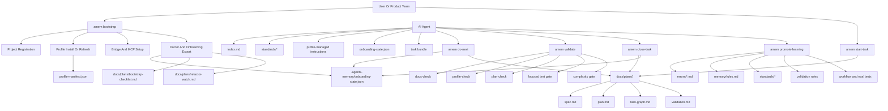
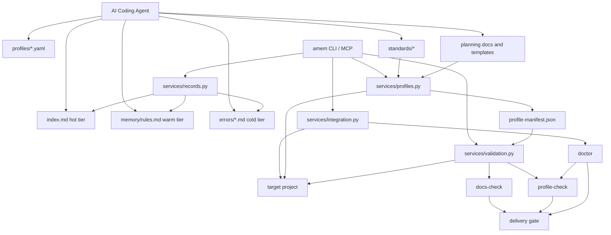

# AI Engineering Operating System

> 最新产品设计基线：把 Agents-Memory 从“共享错误记忆系统”收敛成一个面向 AI coding agents 的工程 Harness。目标不是提供零散工具，而是提供一套开箱即用、可验证、可长期维护的 Shared Engineering Brain。

---

## 产品判断

Agents-Memory 要配得上 AI Engineering Operating System 这个定位，不能停留在 error memory 或 MCP 接入层。

系统必须同时做到：

1. Agent 不只会读错误记忆，还会加载统一工程标准。
2. 新项目不只接 MCP，还能一键安装 profile。
3. 文档不只靠人维护，还能自动校验。
4. 需求到任务图不只靠聊天，而有标准 workflow 模板。
5. 高质量做法能从一个项目沉淀到所有项目。

这意味着产品核心不是“更多命令”，而是“更好的 agent runtime”。

```text
Shared Engineering Brain
├── Memory
├── Standards
├── Planning
├── Validation
└── Learning Bus
```

其中前四层是工程运行时，最后一层是跨项目沉淀总线。

---

## 设计原则

这份设计吸收了三类外部方法论，并只保留与当前产品方向一致的部分：

1. Harness 优先，而不是裸模型优先。
  Agents 的效果取决于 system prompt、tools、context、workflow，而不只是模型参数。
2. 为 agent 设计 workflow tool，而不是 API wrapper。
  低层接口会把状态管理和多步编排推回 agent，自然导致漂移、重复推理和失败率上升。
3. 用 evaluation 和 validation 驱动演进，而不是只靠 instructions 和人工 review。

保留的最新设计约束：

1. Tools 要围绕用户目标建模。
2. Standards 必须尽量可验证。
3. Planning 必须落成标准工件，而不是停留在聊天记录。
4. Delivery 必须经过统一 gate。
5. Learning 必须能从项目经验回写到组织默认保护。

---

## 已废弃设计

以下设计不再作为产品基线，应从后续文档和实现里继续清理：

1. 只把 Agents-Memory 定义为 Shared Error Memory Platform。
2. 把 MCP server 设计成一组薄 API wrapper，让 agent 自己拼工作流。
3. 把 profile 理解为“复制几个说明文件”，而不是项目级工程契约安装器。
4. 把 planning 当成“给人看的模板集合”，而不是任务执行事务中心。
5. 把 docs-sync、profile-check、doctor、tests 分散成互不关联的检查器，而不是统一交付门。
6. 把错误沉淀只写进 errors 和 rules，而不升级到 standards、validation、eval。

这份文档以下内容均以最新基线为准，不再保留上述旧方案的扩展设计。

---

## 最新目标架构

### 1. Memory

负责：

1. 记录错误、复盘和高频案例。
2. 提炼规则和 gotchas。
3. 为 agent 提供热区、温区、冷区三层记忆。

### 2. Standards

负责：

1. 统一 Python、docs、planning、validation 等工程标准。
2. 把组织级默认做法变成 agent 启动即加载的上下文。
3. 与 profile 和 validation 对齐，避免标准成为摆设。

### 3. Planning

负责：

1. 把需求转成 spec、plan、task graph、validation bundle。
2. 让 agent 不是“边聊边做”，而是围绕标准 workflow 执行。
3. 让每个任务都有明确的 done_when、verify_with、status。

### 4. Validation

负责：

1. docs-check
2. profile-check
3. plan-check
4. doctor / onboarding state
5. complexity / maintainability gate

### 5. Learning Bus

负责把项目经验升级成全局默认保护：

```text
project event
  -> error or good practice
  -> record
  -> classify
  -> promote
  -> sync to standards / validation / profile / eval
  -> next project inherits protection
```

### 系统架构图



### 实施状态矩阵

| 能力 | 当前状态 | 说明 |
| --- | --- | --- |
| `Memory` 记录与 promote 基础链路 | done | `new / list / stats / search / promote / sync` 已存在，错误沉淀链路已运行 |
| `Standards` 同步与 profile 受管文件 | partial | profile 管理与 standards-sync 已存在，但仍缺更强的统一发行版入口 |
| `Planning` 基础 bundle 生成 | done | `plan-init`、onboarding/refactor bundle 已存在，bundle 工件已可生成 |
| `Planning` 事务闭环 | partial | 已有 bundle 与 plan-check，但 `close-task` 事务提交还未实现 |
| `Validation` 单项校验器 | done | `docs-check`、`profile-check`、`plan-check`、`doctor` 均已存在 |
| `Validation` 统一 delivery gate | partial | 能力已分散具备，但 `amem validate .` 聚合入口还未落地 |
| `bootstrap` 单入口 workflow | partial | `enable` 已覆盖大部分 bootstrap 语义，但命令模型尚未收敛到 `bootstrap` |
| `start-task` workflow | partial | `plan-init` 已可用，但仍缺完整 task metadata/status contract |
| `do-next` workflow | not_done | 当前主要依赖 onboarding state 和 doctor 输出，尚无统一命令入口 |
| `close-task` workflow | not_done | 尚未实现统一状态回写与完成事务 |
| `promote-learning` workflow | partial | error promote / sync 已有，但还未收敛成跨项目 workflow 命令 |
| 文档元数据与状态校验 | done | 本轮补入 `created_at` / `updated_at` / `doc_status` 规则，并纳入 docs-check / plan-check |

---

## 用户旅程

产品体验必须让普通用户只关注业务，而不是自己拼工程秩序。推荐的标准旅程如下：

1. 用户连接项目。
  入口是 `amem bootstrap .` 或等价的一键接入命令，而不是手动执行一串 setup 命令。
2. 系统自动纳管项目。
  自动完成 register、profile 推荐与安装、bridge、MCP、AGENTS read-order、planning root、doctor 工件。
3. 系统输出 onboarding state。
  明确告诉 agent 现在是否 bootstrap ready，下一步命令是什么，完成判定是什么。
4. 用户提出需求。
  系统不直接进入自由实现，而是先创建 task bundle。
5. 系统生成标准 workflow 工件。
  生成 spec、plan、task graph、validation，并把执行语义写入工件。
6. Agent 围绕任务工件工作。
  不再依赖“聊天里说到哪做到哪”，而是围绕 task graph 和 validation 执行。
7. 系统在交付前统一跑 gate。
  检查 docs、tests、plan、profile、complexity 是否同步闭合。
8. 系统关闭任务并沉淀经验。
  标记哪些任务完成、哪些未完成，并把错误或高质量做法升级到全局共享层。

一句话：

```text
用户只表达业务目标，系统负责工程秩序。
```

---

## 顶层命令模型

产品顶层命令应围绕“用户意图”设计，而不是围绕内部模块设计。

推荐保留和演进为下面 6 个顶层 workflow：

### 1. `amem bootstrap .`

目标：让新项目在数分钟内进入托管状态。

内部完成：

1. project register
2. profile detect / recommend / apply
3. bridge install
4. MCP setup
5. doctor
6. checklist / onboarding-state 导出

### 2. `amem start-task "<task>" .`

目标：把需求转成标准执行工件。

内部完成：

1. 创建 spec
2. 创建 plan
3. 创建 task graph
4. 创建 validation bundle

### 3. `amem do-next .`

目标：让 agent 不用自己判断现在下一步该做什么。

内部完成：

1. 读取 onboarding state
2. 读取当前 task bundle
3. 返回当前阻塞项、推荐动作和验证命令

### 4. `amem validate .`

目标：成为统一交付门。

内部完成：

1. docs-check
2. profile-check
3. plan-check
4. focused test gate
5. complexity / maintainability gate

### 5. `amem close-task .`

目标：把“做完”变成事务式收口，而不是主观判断。

内部完成：

1. 确认 validation 通过
2. 更新 task graph status
3. 更新 bundle summary
4. 回写完成时间、验证结果、未完成事项

### 6. `amem promote-learning .`

目标：把本项目经验升级成跨项目默认保护。

内部完成：

1. 错误分类
2. rule promote
3. standards sync candidate
4. validation rule candidate
5. eval case candidate

这些命令体现的原则是：

```text
用户感知的是 workflow
不是内部 service / command 的实现边界
```

---

## 状态机设计

长期稳定性依赖明确状态机，而不是 agent 自由发挥。

### 项目状态机

```text
unmanaged
  -> bootstrapping
  -> bootstrap_ready
  -> bootstrap_complete
  -> governed
```

状态含义：

1. `unmanaged`
  项目尚未接入 Shared Engineering Brain。
2. `bootstrapping`
  正在安装 profile、MCP、bridge、planning root、validation 工件。
3. `bootstrap_ready`
  基础阻塞项已消除，可以开始业务任务。
4. `bootstrap_complete`
  推荐 follow-up 也已完成，项目进入长期托管状态。
5. `governed`
  项目持续使用 profile、planning、validation 和 learning bus 维护。

### 任务状态机

```text
draft
  -> planned
  -> ready
  -> in_progress
  -> validating
  -> completed
  -> archived
```

状态含义：

1. `draft`
  需求已出现，但工件未闭合。
2. `planned`
  spec / plan / task graph 已存在，但未满足开工条件。
3. `ready`
  前置依赖明确，可进入实现。
4. `in_progress`
  agent 正在按 task graph 执行。
5. `validating`
  代码、文档、测试已更新，正在经过统一 gate。
6. `completed`
  所有 required checks 通过，bundle 和状态回写完毕。
7. `archived`
  任务生命周期结束，仅保留审计和复用价值。

### 任务不变量

一个任务只有在以下条件同时成立时才能进入 `completed`：

1. 代码已更新。
2. 文档已更新。
3. 测试已更新或明确记录 why not。
4. validation gate 已通过。
5. task graph 状态已回写。

这意味着：

```text
close_task 不是 git commit
而是任务事务提交
```

---

## 工件模型

Agents-Memory 要长期不崩，核心在于把运行状态和任务状态显式写入工件，而不是只存在对话中。

### 项目级工件

1. `profile-manifest.json`
  记录项目已安装的工程契约。
2. `.agents-memory/onboarding-state.json`
  记录项目当前 bootstrap 状态、下一步动作、执行历史。
3. `docs/plans/bootstrap-checklist.md`
  人与 agent 共用的 bootstrap 审计材料。
4. `docs/plans/refactor-watch.md`
  复杂度治理入口。
5. `AGENTS.md` 受管 block
  记录 read-order 和共享上下文装载入口。

### 任务级工件

每个任务 bundle 至少包含：

1. `README.md`
2. `spec.md`
3. `plan.md`
4. `task-graph.md`
5. `validation.md`

### Task Graph 最小字段

每个 task item 至少应具备：

1. `id`
2. `title`
3. `depends_on`
4. `status`
5. `done_when`
6. `verify_with`
7. `touches_code`
8. `touches_docs`
9. `touches_tests`

### 工件设计原则

1. 工件既要给人读，也要给 agent 读。
2. 工件要写执行语义，不只写说明文字。
3. 工件要支持回写状态，而不是一次性生成后就失效。
4. 工件要能进入 validation gate。

---

## 测试与验证矩阵

长期由 agent 维护不崩，靠的是多层验证，而不是“模型足够聪明”。

### 1. Unit Tests

目标：

1. 验证纯逻辑 helper。
2. 限制函数复杂度继续膨胀。
3. 降低重构成本。

### 2. Workflow Tests

目标：验证完整工作流不会断裂。

建议覆盖：

1. bootstrap
2. start-task
3. do-next
4. validate
5. close-task
6. promote-learning

### 3. Golden Artifact Tests

目标：防止工件结构和文档语义漂移。

建议覆盖：

1. onboarding-state.json
2. bootstrap-checklist.md
3. task bundle 全套文件
4. profile-manifest.json

### 4. Delivery Gate Tests

目标：验证交付门本身可靠。

建议覆盖：

1. docs drift
2. profile drift
3. plan drift
4. test drift
5. complexity drift

### 5. Agent Eval Tests

目标：验证 agent 是否真的会按系统设计使用这些能力。

建议覆盖：

1. 是否会先读取 onboarding state
2. 是否会先创建 bundle 再实现
3. 是否会在修改代码后同步更新文档与测试
4. 是否会在 gate 失败时继续修复而不是直接结束
5. 是否会在任务完成后正确回写状态

### 统一交付门要求

所有重要任务都应经过统一 delivery gate，至少检查：

1. bundle 完整性
2. docs-sync
3. profile consistency
4. focused tests
5. complexity budget

如果一个标准不能进入 gate，它就不是系统级标准，只是说明文案。

---

## 长期维护约束

为了让项目长期由 agent 维护仍然稳定，必须坚持下面 6 条约束：

1. 所有重要变更必须绑定 task bundle。
2. 所有任务必须有明确完成定义。
3. 所有交付必须经过统一 delivery gate。
4. 所有标准都应尽可能有对应验证器。
5. 所有经验都必须进入回写闭环。
6. 所有任务完成都必须是文档、代码、测试、状态一起更新的原子事务。

这 6 条约束的目标只有一个：

```text
让普通用户通过 agent 做项目时
默认享受到一致的、高水平的、可长期扩展的工程规范与验证规则
而不需要自己维护这些秩序
```

---

## 当前产品重心

在当前仓库阶段，最重要的不是继续增加零散命令，而是把下面 4 件事做深：

1. 把 profile 做成真正的项目发行版。
2. 把 planning bundle 做成任务事务中心。
3. 把 validation 收敛成统一 delivery gate。
4. 把 learning 做成从单项目沉淀到全项目保护的总线。

这 4 件事如果做稳，Agents-Memory 才真正配得上 AI Engineering Operating System 这个目标。

---

## Repo 级实施方案

这一节只讨论当前仓库的直接实施，不讨论抽象愿景。

目标是把新主设计落成 4 组仓库级对象：

1. 命令
2. 状态文件
3. 验证器
4. 测试计划

### 一. 命令实施方案

当前仓库已经有 `enable`、`doctor`、`plan-init`、`onboarding-bundle`、`refactor-bundle`、`profile-apply`、`docs-check` 等基础能力。下一阶段不建议继续暴露更多底层命令，而应收敛成 workflow 入口。

| 命令 | 目标 | 当前基础 | 下一步实现重点 | 主要输出 |
| --- | --- | --- | --- | --- |
| `amem bootstrap .` | 一键纳管项目 | `enable` + `doctor` + `profile-apply` + `bridge-install` + `mcp-setup` | 增加统一入口、自动 profile 推荐、标准化 summary 输出 | `profile-manifest.json`、`onboarding-state.json`、`bootstrap-checklist.md` |
| `amem start-task "<task>" .` | 生成任务事务工件 | `plan-init` | 增加任务元数据、状态字段、done_when / verify_with 规范 | `docs/plans/<slug>/` bundle |
| `amem do-next .` | 返回 agent 当前下一步动作 | `onboarding_next_action`、state 读取 helper | 同时读取 onboarding state 和 task bundle，输出 blocking / recommended 动作 | 结构化 next-action payload |
| `amem validate .` | 统一交付门 | `docs-check`、`profile-check`、`plan-check`、doctor、refactor-watch | 增加统一总结果、按 required / recommended 分组、支持 JSON | delivery gate report |
| `amem close-task .` | 原子化关闭任务 | 现有能力缺失 | 校验 gate 后回写 task graph、validation summary、completion status | task completion marker + bundle 回写 |
| `amem promote-learning .` | 跨项目沉淀经验 | `record_error`、`promote`、`sync` | 增加从 error 到 standards / validation / eval 的升级分流 | rules / standards / validators / tests 更新建议 |

实施优先级建议：

1. 先实现 `bootstrap`，把项目入口统一掉。
2. 再实现 `validate`，把交付门统一掉。
3. 再实现 `start-task` 和 `close-task`，把任务事务闭环补齐。
4. 最后实现 `do-next` 和 `promote-learning`，把 agent 执行体验和跨项目沉淀打通。

### 二. 状态文件实施方案

状态文件不是辅助材料，而是 agent runtime 的真实状态面。

| 文件 | 作用 | 写入方 | 读取方 | 约束 |
| --- | --- | --- | --- | --- |
| `.agents-memory/onboarding-state.json` | 项目 bootstrap 状态、下一步动作、执行历史 | `doctor`、`onboarding-execute`、未来 `bootstrap` | agent、`do-next`、CLI、MCP | 必须幂等回写；字段增量演进；不依赖对话上下文 |
| `profile-manifest.json` | 项目已安装工程契约 | `profile-apply`、`enable --full`、未来 `bootstrap` | `profile-check`、`validate`、agent | 必须可用于 drift 检测，不允许只写 display 信息 |
| `docs/plans/bootstrap-checklist.md` | bootstrap 审计材料 | `doctor --write-checklist`、未来 `bootstrap` | 人、agent、review | 必须和 state 对齐，不允许出现互相矛盾的 next step |
| `docs/plans/refactor-watch.md` | 复杂度治理工件 | `doctor --write-checklist` | 人、agent、`refactor-bundle` | 必须能追溯到稳定 hotspot token |
| `docs/plans/<task-slug>/README.md` | 任务入口摘要 | `start-task`、`close-task` | 人、agent | 要能快速定位目标、状态、风险 |
| `docs/plans/<task-slug>/spec.md` | 任务边界和约束 | `start-task` | agent、review | 必须写目标、非目标、约束、acceptance |
| `docs/plans/<task-slug>/plan.md` | 任务执行设计 | `start-task`、实现阶段 | agent、review | 必须写 change set、关键决策、验证策略 |
| `docs/plans/<task-slug>/task-graph.md` | 任务状态机承载物 | `start-task`、`close-task`、未来 `do-next` | agent、review、validation | 必须具备结构化状态字段 |
| `docs/plans/<task-slug>/validation.md` | 当前任务 gate 契约 | `start-task`、`validate` | agent、gate、review | 必须写 verify_with、required checks、done_when |

建议的状态字段原则：

1. 所有状态文件都必须允许 agent 直接消费。
2. 所有状态文件都必须支持增量回写。
3. 所有状态文件都必须对应至少一个验证器。
4. 不把关键状态只放在 markdown prose 里。

### 三. 验证器实施方案

验证器决定 Agents-Memory 是不是“操作系统”，因为只有验证器能防止长期漂移。

| 验证器 | 检查目标 | 当前基础 | 下一步实现重点 | 失败后动作 |
| --- | --- | --- | --- | --- |
| `docs-check` | 文档入口、命令覆盖、contract / policy / test 语义 | 已有 | 增加 task bundle 文档同步检查、原子更新检查 | 阻止任务关闭 |
| `profile-check` | profile-managed 文件一致性 | 已有 | 增加 AGENTS 受管 block、planning root、validation assets 检查 | 提示 refresh 或 drift repair |
| `plan-check` | planning bundle 完整性与关键语义 | 已有 | 增加 task graph 状态闭合、done_when / verify_with 必填检查 | 阻止实现继续或阻止 close-task |
| `doctor` | 项目整体 onboarding / readiness | 已有 | 收敛成 `bootstrap` 的主状态源，减少重复概念 | 输出下一步动作和导出工件 |
| `refactor-watch` | 复杂度与可维护性预算 | 已有 | 纳入 `validate` 总门，并把热点关联到当前任务 | 要求先重构再继续叠加功能 |
| `test gate` | 当前任务最小回归覆盖 | 部分依赖测试命令 | 增加 task-scoped test command 和 required checks 汇总 | 阻止 close-task |
| `delivery gate` | 统一交付结果 | 缺失 | 聚合 docs / profile / plan / test / complexity | 成为 `validate` 和 `close-task` 的共同入口 |

统一 delivery gate 建议输出字段：

1. `overall`
2. `required_failures`
3. `recommended_warnings`
4. `checked_files`
5. `task_slug`
6. `verify_commands`
7. `can_close_task`

### 四. 测试计划

测试计划应服务于“长期 agent 维护不崩”，而不是只服务单次功能开发。

| 测试层 | 目标 | 应覆盖对象 | 当前基础 | 下一步重点 |
| --- | --- | --- | --- | --- |
| Unit tests | 稳定纯逻辑和状态 helper | services 内部 helper | 较完整 | 持续为新 state / gate helper 补最小回归 |
| Workflow tests | 保证命令级流程不断裂 | `bootstrap`、`start-task`、`validate`、`close-task` | 现有覆盖偏分散 | 增加 end-to-end workflow fixtures |
| Golden artifact tests | 防止工件格式和语义漂移 | onboarding state、bootstrap checklist、task bundle、profile manifest | 部分已有 | 增加 task bundle snapshot tests |
| Gate tests | 保证验证器能正确拦截 | docs drift、profile drift、plan drift、test drift、complexity drift | 已有单点测试 | 增加统一 delivery gate pass/fail matrix |
| Agent eval tests | 保证 agent 真会按设计使用系统 | next action 选择、bundle 创建、同步 docs/tests、close-task 回写 | 当前缺失 | 引入 prompt-to-outcome workflow eval |

推荐实施节奏：

1. P0：补 `bootstrap`、`validate` 的 workflow tests。
2. P1：补 task bundle 的 golden artifact tests。
3. P2：补 `close-task` 和 `promote-learning` 的 end-to-end tests。
4. P3：建立真实任务集驱动的 agent eval tests。

### 交付判定

只有当下面 5 项都成立时，才算真正进入长期可维护状态：

1. 项目可通过单入口 bootstrap 纳管。
2. 任务可通过 bundle 进入事务式执行。
3. 交付可通过统一 gate 判断是否完成。
4. 经验可从项目回流到全局标准与验证。
5. 这些能力都有稳定的 tests 和工件回归保护。

### 已有

1. 共享错误
2. 共享错误提炼规则
3. 跨项目接入：bridge / MCP / agent adapter
4. 项目注册、doctor、rule sync
5. MCP tools：`memory_get_index` / `memory_get_rules` / `memory_search` / `memory_record_error`

### 缺失

1. 统一工程规范层
2. 统一 profile 安装层
3. 统一 docs-check / standards-check
4. 统一 Harness Engineering workflow 模板
5. 统一 Spec Kit 风格 spec-first 约束

当前系统更像：

```text
Shared Error Memory Platform
```

目标系统应升级为：

```text
AI Engineering Operating System
```

---

## 3. 目标能力模型

目标产品不是一个单独的 memory 仓库，而是一个 **Shared Engineering Brain**，由四层能力组合而成。

```text
Shared Engineering Brain
├── Memory
├── Standards
├── Planning
└── Validation
```

### Layer 1. Memory

负责：

1. 共享错误
2. 共享错误搜索
3. 共享错误提炼规则
4. 自我进化闭环

现有落点：

1. `errors/*.md`
2. `memory/rules.md`
3. `index.md`
4. `promote / sync / doctor / record_error`

### Layer 2. Standards

负责：

1. 统一 Python 开发规范
2. 统一 TDD / DRY / 工程化约束
3. 统一文档规范
4. 统一 review checklist

这层不依赖错误发生，而是组织级默认契约。

### Layer 3. Planning

负责：

1. Harness Engineering workflow
2. Requirement → Plan → Task Graph
3. Spec Kit 风格 spec-first 约束
4. 执行计划模板、评审材料模板、验收标准模板

### Layer 4. Validation

负责：

1. docs-check
2. profile-check
3. standards-check
4. project doctor
   应继续升级为 onboarding runbook，输出推荐命令、验证动作、下一条命令与完成判定，并可导出 checklist / onboarding state 工件
5. bootstrap completeness check

这层负责把规则真正落地，否则 standards 只是文档陈列。

### 3.1 系统架构图



### 为什么必须是四层，而不是单一 memory

如果只有 `Memory`，系统只能做到：

1. 记录过去犯过什么错
2. 尽量避免重复犯错

但它做不到：

1. 在错误发生前统一约束开发方式
2. 在任务开始前统一规划与拆解
3. 在交付前自动校验文档、契约、测试与策略合规性

所以最终产品的定义必须是：

```text
Memory     管过去
Standards  管日常开发
Planning   管任务落地
Validation 管交付质量
```

只有这四层同时存在，Agents-Memory 才能从“错误记忆库”进化成“工程大脑”。

---

## 4. 产品核心闭环

未来完整闭环应该是：

```text
组织定义工程规范
  ↓
profile 安装到具体项目
  ↓
agent 开始工作前加载：index + standards + profile + workflow
  ↓
按 spec / task graph / docs-check 执行
  ↓
出现错误时记录到 errors
  ↓
重复错误提炼为 rules / gotchas
  ↓
同步回标准层或项目层
  ↓
下次自动规避
```

这里的关键升级是：

1. 错误不再是唯一数据源
2. 标准、计划、校验也成为共享系统的一等公民

---

## 5. 新的目录设计

建议把仓库扩成下面的结构。

```text
Agents-Memory/
├── agents_memory/
├── templates/
├── standards/
│   ├── python/
│   │   ├── base.instructions.md
│   │   ├── tdd.instructions.md
│   │   ├── dry.instructions.md
│   │   └── project-structure.instructions.md
│   ├── docs/
│   │   ├── docs-sync.instructions.md
│   │   ├── docs-check.rules.md
│   │   └── glossary.rules.md
│   ├── planning/
│   │   ├── harness-engineering.md
│   │   ├── spec-kit.md
│   │   ├── requirement-to-task-graph.md
│   │   └── review-checklist.md
│   └── validation/
│       ├── docs-check.rules.md
│       ├── standards-check.rules.md
│       └── profile-check.rules.md
├── profiles/
│   ├── python-service.yaml
│   ├── frontend-app.yaml
│   ├── fullstack-product.yaml
│   └── agent-runtime.yaml
├── docs/
└── scripts/
```

### 目录职责

#### `standards/`

组织级工程标准库。

内容必须是：

1. 跨项目复用
2. 不依赖单个项目私有上下文
3. 适合被自动同步或自动校验

#### `profiles/`

项目装配配置层。

每个 profile 描述：

1. 适用项目类型
2. 需要安装哪些 standards
3. 需要安装哪些 instructions
4. 需要生成哪些模板
5. 需要启用哪些校验命令

---

## 6. `standards/` 目录设计

### 6.1 Python 标准

建议拆成下面几类，而不是塞进一个大文件：

1. `base.instructions.md`
   Python 版本基线、typing、异常处理、依赖管理、目录结构

2. `tdd.instructions.md`
   测试先行、最小失败用例、回归测试要求、变更必须绑定验证

3. `dry.instructions.md`
   禁止复制粘贴实现、抽象边界、复用判断标准

4. `project-structure.instructions.md`
   服务层、仓储层、schema 层、CLI 层、入口层约束

### 6.2 Docs 标准

1. `docs-sync.instructions.md`
   行为变更必须同步 docs / examples / readme / instruction

2. `docs-check.rules.md`
   必填章节、链接完整性、术语一致性、命令有效性

3. `glossary.rules.md`
   统一术语表，减少项目间命名漂移

### 6.3 Planning 标准

1. `harness-engineering.md`
   接受 Harness Engineering 作为统一工作流基线

2. `spec-kit.md`
   接受 Spec Kit 风格的 spec-first 约束

3. `requirement-to-task-graph.md`
   需求如何转成任务图、依赖、验收点

4. `review-checklist.md`
   评审最小材料包：spec、plan、task graph、docs diff、validation

---

## 7. `profiles/` 目录设计

profile 的作用不是写规范，而是“装配规范”。

### 7.1 示例：`python-service.yaml`

建议至少包含这些字段：

```yaml
id: python-service
display_name: Python Service
applies_to:
  - backend
  - fastapi
standards:
  - standards/python/base.instructions.md
  - standards/python/tdd.instructions.md
  - standards/python/dry.instructions.md
  - standards/docs/docs-sync.instructions.md
  - standards/planning/harness-engineering.md
templates:
  - templates/profile/python-service/AGENTS.example.md
  - templates/profile/python-service/docs-check.example.yml
commands:
  docs_check: amem docs-check
  doctor: amem doctor
  standards_sync: amem standards-sync
bootstrap:
  create:
    - .github/instructions/
    - docs/
    - tests/
```

### 7.2 初始 profile 集合

建议先做 4 个：

1. `python-service`
2. `frontend-app`
3. `fullstack-product`
4. `agent-runtime`

这是第一批最容易落地、覆盖面也最大的 profile。

---

## 8. `amem profile-apply` 命令设计

### 目标

把 profile 从“文档说明”变成“真正可安装的工程契约”。

### 建议命令形态

```bash
amem profile-list
amem profile-show python-service
amem profile-apply python-service /path/to/project
amem profile-diff python-service /path/to/project
```

### `profile-apply` 需要做的事

1. 读取 `profiles/<id>.yaml`
2. 在目标项目创建缺失目录
3. 安装 / 更新 instructions
4. 写入模板文件
5. 写入 docs-check 配置
6. 输出后续验证命令

### 最小行为规范

1. 幂等
2. 不覆盖用户已有内容，优先 merge / append
3. 输出 diff summary
4. 支持 dry-run

### 推荐输出

```text
Applied profile: python-service
- installed 4 standards
- wrote 2 templates
- skipped 1 existing file
- next: amem docs-check / amem doctor
```

---

## 9. `amem docs-check` 命令设计

### 目标

给所有项目提供统一的文档校验能力，而不是只靠人工 review。

### 第二版校验范围

1. 必需入口文档是否存在
2. README / AGENTS / docs index 是否互相可达
3. 命令示例是否存在明显死链或无效路径
4. 术语是否符合 glossary
5. 行为变更文档是否缺同步
6. contract 文档与关键工程语义是否齐备
7. 测试目录、关键测试文件、验证命令是否齐备
8. policy / standards 文件与治理语义是否齐备

### 建议命令形态

```bash
amem docs-check /path/to/project
amem docs-check /path/to/project --strict
amem docs-check /path/to/project --format json
```

### 输出模型

```text
Docs Check: PARTIAL

[OK]    README exists
[OK]    AGENTS read-order linked
[WARN]  docs/index missing command reference for amem doctor
[FAIL]  glossary mismatch: "taskflow" vs "task graph"
```

### 后续可扩展项

1. Markdown link checker
2. 命令片段执行校验
3. spec / contract / example 一致性校验
4. 与 CI 集成

---

## 10. 同步机制设计

系统以后不应只有 `sync promoted rules` 一种同步。

建议拆成三种同步：

### 10.1 `amem sync-rules`

职责：

1. 把错误提炼规则同步到项目 instructions

这就是当前 `sync` 的语义，应继续保留。

### 10.2 `amem standards-sync`

职责：

1. 把 `standards/` 中的组织级标准同步到目标项目
2. 支持项目覆盖层，不强行覆盖本地定制

当前进度：`standards-sync` 第一版已完成，现已支持基于已安装 profile 同步受管标准文件。

### 10.3 `amem profile-apply`

职责：

1. 安装一整套项目配置、模板、校验器和 instructions

所以未来模型应当是：

```text
rules sync      = 错误进化回流
standards sync  = 组织标准下发
profile apply   = 项目装配执行
```

---

## 11. Harness Engineering 与 Spec Kit 的纳入方式

### Harness Engineering

结论：接受为统一工作流基线。

落地方式：

1. 作为 `standards/planning/harness-engineering.md`
2. 提供 `requirement -> plan -> task graph -> validation` 模板
3. 进入 `profile-apply` 的默认安装集

当前进度：`plan-init` 第一版已完成，可在目标项目的 `docs/plans/<task>/` 下生成 planning bundle。
当前进度：`plan-check` 第一版已完成，可校验 planning bundle 的完整性与关键语义。
当前进度：`doctor` 已开始感知 planning root 和 planning bundle 健康状态，并正在升级成带行动序列、推荐命令、验证动作、下一条命令与完成判定的 onboarding runbook，同时生成 project bootstrap checklist，并支持导出 markdown/json 工件。
当前进度：导出的 `onboarding-state.json` 已开始承载 `project_bootstrap_ready`、`recommended_next_command` 等 agent 可直接消费的状态字段，可作为进入项目时的自动化前置输入。
当前进度：系统已能根据 `onboarding-state.json` 直接生成 onboarding task bundle，并可通过 MCP tool 暴露结构化 state 给 agent。
当前进度：系统已新增直接返回第一步动作的 MCP tool，并支持对已有 onboarding bundle 做增量刷新。
当前进度：系统已新增执行第一步动作并回写 `execution_history` / `last_verified_action` 的 CLI 与 MCP 闭环，使 onboarding state 从“建议”升级为“可执行且可验证的运行状态”。
当前进度：执行闭环已升级为可审批执行器，runbook step 会显式给出 `safe_to_auto_execute` 与 `approval_required`，agent 仅自动运行低风险步骤，高风险步骤需人工批准。
当前进度：代码标准已纳入复杂度重构门槛，命中高复杂度标准的函数应先重构，再继续叠加能力。
当前进度：`doctor` 已开始输出 `refactor_watch`，可主动提示逼近复杂度阈值的 Python 函数，并额外指出复杂逻辑缺少解释性注释的热点。
当前进度：`refactor_watch` 已支持导出为 `docs/plans/refactor-watch.md`，使复杂度热点开始沉淀为可追踪的 planning 工件。

### Spec Kit

结论：接受为统一 spec-first 规范来源。

落地方式：

1. 作为 `standards/planning/spec-kit.md`
2. 提供 spec template、acceptance checklist、change contract template
3. 在 `docs-check` 中校验 spec 完整性

---

## 12. MVP 路线

为了避免空转，建议只做下面 5 个增量目标：

### MVP-1

保留现有 Memory 核心：

1. 共享错误
2. 共享规则
3. 自我进化闭环

### MVP-2

新增 `standards/`：

1. Python baseline
2. TDD / DRY baseline
3. docs-sync baseline
4. Harness Engineering baseline

### MVP-3

新增 `profiles/`：

1. `python-service`
2. `frontend-app`

### MVP-4

新增命令：

1. `amem profile-list`
2. `amem profile-show`
3. `amem plan-init`（已完成第一版）
4. `amem plan-check`（已完成第一版）
5. `amem profile-apply`
6. `amem standards-sync`（已完成第一版）
7. `amem profile-check`（已完成第一版）
8. `amem docs-check`（已完成第二版）

### MVP-5

新增统一校验：

1. docs-check
2. profile-check：已完成第一版
3. project doctor 扩展：已完成第一版

---

## 13. 成功标准

如果 Agents-Memory 要配得上 **AI Engineering Operating System** 这个产品目标，至少要满足：

1. Agent 不只会读错误记忆，还会加载统一工程标准
2. 新项目不只接 MCP，还能一键安装 profile
3. 文档不只靠人管，还能自动校验
4. 需求到任务图不只靠聊天，而有标准 workflow 模板
5. 高质量做法能从一个项目沉淀到所有项目

如果换一种更强的定义，成功标准可以写成：

```text
Shared Engineering Brain =
  Memory
  + Standards
  + Planning
  + Validation
```

当 Agent 在开始任务时能同时获得：

1. 过去错误的记忆
2. 当前组织的工程标准
3. 当前任务的 planning workflow
4. 当前交付的验证与质量门禁

这时 Agents-Memory 才真正成为工程系统的大脑，而不是一个被动的错误仓库。

---

## 14. 下一步实现建议

建议下一步直接进入可执行设计，而不是继续写抽象概念文档。

优先顺序：

1. `standards/` 目录设计与首批标准文件：已完成
2. `profiles/` 目录设计与 `python-service` profile：已完成第一版
3. `amem profile-apply` 命令实现：已完成第一版
4. `amem profile-check` 命令实现：已完成第一版
5. `amem docs-check` 命令实现：已完成第二版

这四步做完，Agents-Memory 才会从“共享错误记忆系统”升级成真正可执行的工程治理底座。
